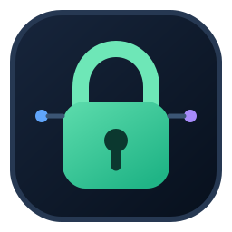
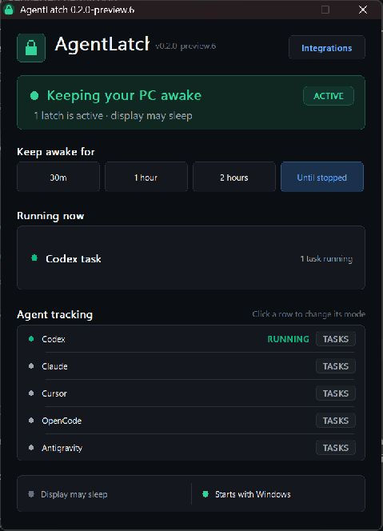

<p align="center">
  
</p>

<h1 align="center">AgentLatch</h1>

<p align="center"><strong>Your agents run. Your PC stays awake.</strong></p>

AgentLatch is a lightweight, open-source Windows tray app that prevents idle sleep only while useful work is still running. It understands concurrent AI coding agents, exposes every active reason, and releases Windows the moment the final latch ends.

<p align="center">
  
</p>

## Why AgentLatch

- **Agent-aware:** watches Codex, Claude Code, Cursor, OpenCode, and Google Antigravity/Gemini CLI.
- **Concurrency-safe:** four subagents and one manual timer become five independent latches; sleep resumes only after all five release.
- **Your choice of precision:** set every provider independently to **Tasks**, **Open**, or **Off**.
- **Task-first by default:** Codex desktop lifecycle records and provider hooks track actual work; conservative CLI activity detection is the fallback.
- **Open when you want it:** presence mode deliberately latches while the selected app or CLI is merely running.
- **Transparent:** the dashboard shows exactly what is keeping the machine awake and why.
- **Still a great wake utility:** 30-minute, one-hour, two-hour, and until-released controls are always one click away.
- **Native and private:** one Win32 executable, no account, no service, no telemetry, and no administrator rights.

AgentLatch uses a Windows power request. It does not jiggle the mouse, synthesize keystrokes, change the system power plan, or prevent a user-initiated shutdown or sleep.

## Provider support

| Provider | Tasks mode | Open mode | Lifecycle hooks |
|---|---|---|---|
| Codex | Native desktop lifecycle + hooks/CLI activity | Desktop app or CLI | Desktop tasks; CLI sessions and subagents |
| Claude Code | Hooks + CLI activity | Desktop app or CLI | Sessions and subagents |
| Cursor | Hooks + agent CLI activity | Cursor IDE or agent CLI | Agent and subagent events |
| OpenCode | CLI activity | CLI process | External lease API |
| Google Antigravity / Gemini CLI | Antigravity hooks + CLI activity | Antigravity app or Gemini CLI | Antigravity conversations |

In **Tasks** mode, opening an Electron app by itself never latches the computer. Native lifecycle state and hooks acquire a bounded latch when work begins and release it when the provider reports completion. Hook leases expire automatically if an agent crashes or never sends a final event. Click a provider in the dashboard to cycle **Tasks → Open → Off**.

## Install

1. Download `AgentLatch-Setup-<version>-x64.exe` from the latest release.
2. Double-click the setup executable.
3. Choose whether AgentLatch should start with Windows, then select **Install**.

Setup installs AgentLatch for the current user without an administrator prompt, creates normal Start menu and Windows uninstall entries, replaces an older running copy cleanly, and launches the new version. The exact build number is always visible beside the AgentLatch name in the dashboard and in the window title.

Codex, Claude Code, Cursor, and Google Antigravity lifecycle integrations are installed automatically. Existing provider configuration is preserved, duplicate entries are avoided, and a timestamped backup is made before a changed JSON file is written. The Windows uninstaller removes only AgentLatch's own integration entries.

Codex desktop task detection is native and automatic: AgentLatch reads the local start/complete lifecycle stream that Codex already maintains. No chat command, hook trust dialog, or separate setup step is required. Codex CLI hooks remain an additional signal when available.

Early preview installers may display a Windows SmartScreen warning until project releases are Authenticode-signed.

## Command-line lease API

Any local tool can acquire a renewable latch:

```powershell
AgentLatch.exe --acquire --id build-42 --source external --label "Release build" --detail "ARM64 package" --ttl 900
AgentLatch.exe --release --id build-42
```

Leases are local to the signed-in Windows session, fields are bounded and sanitized, and TTLs are capped at 24 hours. Repeating `--acquire` with the same ID renews that lease.

Other commands:

```text
--show           Open the dashboard
--quit           Exit the background app
--self-test      Run the built-in core tests
--hook PROVIDER  Accept one lifecycle event as JSON on stdin
```

## Build from source

Requirements:

- Windows 10 or Windows 11
- Visual Studio 2022 Build Tools with Desktop development with C++
- CMake 3.24 or newer
- Inno Setup 7 when building the Windows setup executable

```powershell
git clone https://github.com/byassin/agent-latch.git
cd agent-latch
.\scripts\build.ps1
```

The x64 build script runs the executable's self-test before reporting success. CI also compiles ARM64.

Build the setup executable after compiling AgentLatch:

```powershell
.\scripts\build-installer.ps1 -Executable .\build\Release\AgentLatch.exe -Version 0.2.0
```

## Design principles

- A wake reason is a lease, never an unexplained global switch.
- The display is allowed to turn off by default while the system stays awake.
- Every automatic path has a timeout or observable process state.
- Provider integrations are additive and editable; existing hook configuration belongs to the user.
- Normal Windows sleep behavior returns immediately when the last latch releases.

Read [Architecture](docs/ARCHITECTURE.md), [Privacy](docs/PRIVACY.md), and [Contributing](CONTRIBUTING.md) for more.

## License

AgentLatch is available under the [MIT License](LICENSE).
