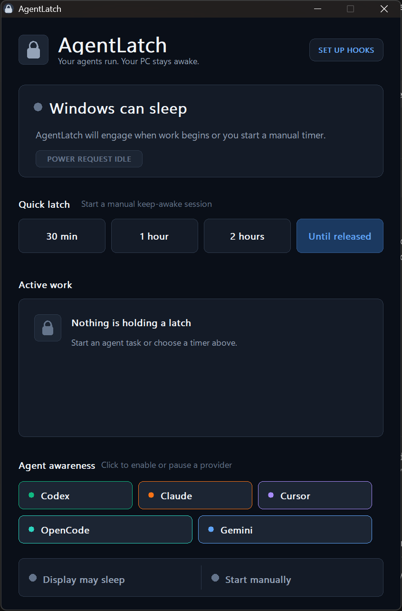

<p align="center">
  
</p>

<h1 align="center">AgentLatch</h1>

<p align="center"><strong>Your agents run. Your PC stays awake.</strong></p>

AgentLatch is a lightweight, open-source Windows tray app that prevents idle sleep only while useful work is still running. It understands concurrent AI coding agents, exposes every active reason, and releases Windows the moment the final latch ends.

<p align="center">
  
</p>

## Why AgentLatch

- **Agent-aware:** watches Codex, Claude Code, Cursor, OpenCode, and Gemini CLI.
- **Concurrency-safe:** four subagents and one manual timer become five independent latches; sleep resumes only after all five release.
- **Precise when possible:** optional lifecycle hooks track sessions and subagents instead of guessing from a process name.
- **Useful without setup:** a low-overhead process/activity detector works immediately as a fallback.
- **Transparent:** the dashboard shows exactly what is keeping the machine awake and why.
- **Still a great wake utility:** 30-minute, one-hour, two-hour, and until-released controls are always one click away.
- **Native and private:** one Win32 executable, no account, no service, no telemetry, and no administrator rights.

AgentLatch uses a Windows power request. It does not jiggle the mouse, synthesize keystrokes, change the system power plan, or prevent a user-initiated shutdown or sleep.

## Provider support

| Provider | Automatic detection | Lifecycle hooks | Concurrent work |
|---|---:|---:|---:|
| Codex | Yes | Yes | Sessions and subagents |
| Claude Code | Yes | Yes | Sessions and subagents |
| Cursor | Yes | Yes, where supported | Agent and subagent events |
| OpenCode | Yes | External lease API | Process trees |
| Gemini CLI | Yes | External lease API | Process trees |

Hooks renew bounded leases and release them on stop events. If an agent crashes or never sends a final event, the lease expires automatically. Process detection remains available as a safety net and can be disabled independently for each provider.

## Get started

### Portable

1. Download the release ZIP for your architecture.
2. Extract it anywhere.
3. Run `AgentLatch.exe`.

Closing the dashboard keeps AgentLatch in the notification area. Use the dashboard or tray menu to enable **Start with Windows**.

### Optional install

From the extracted release folder:

```powershell
.\scripts\install.ps1 -StartWithWindows
```

Add precise Codex, Claude Code, and Cursor lifecycle hooks from the **Set up hooks** button, or run:

```powershell
.\scripts\install-integrations.ps1 -AgentLatchPath "$env:LOCALAPPDATA\AgentLatch\AgentLatch.exe"
```

The integration installer preserves existing configuration, avoids duplicate entries, and creates a timestamped backup before every changed JSON file. See [Integrations](docs/INTEGRATIONS.md) for provider-specific details.

## Command-line lease API

Any local tool can acquire a renewable latch:

```powershell
AgentLatch.exe --acquire --id build-42 --source external --label "Release build" --detail "ARM64 package" --ttl 900
AgentLatch.exe --release --id build-42
```

Leases are local to the signed-in Windows session, fields are bounded and sanitized, and TTLs are capped at 24 hours. Repeating `--acquire` with the same ID renews that lease.

Other commands:

```text
--show           Open the dashboard
--quit           Exit the background app
--self-test      Run the built-in core tests
--hook PROVIDER  Accept one lifecycle event as JSON on stdin
```

## Build from source

Requirements:

- Windows 10 or Windows 11
- Visual Studio 2022 Build Tools with Desktop development with C++
- CMake 3.24 or newer

```powershell
git clone https://github.com/byassin/agent-latch.git
cd agent-latch
.\scripts\build.ps1
```

The x64 build script runs the executable's self-test before reporting success. CI also compiles ARM64.

## Design principles

- A wake reason is a lease, never an unexplained global switch.
- The display is allowed to turn off by default while the system stays awake.
- Every automatic path has a timeout or observable process state.
- Provider integrations are additive and editable; existing hook configuration belongs to the user.
- Normal Windows sleep behavior returns immediately when the last latch releases.

Read [Architecture](docs/ARCHITECTURE.md), [Privacy](docs/PRIVACY.md), and [Contributing](CONTRIBUTING.md) for more.

## License

AgentLatch is available under the [MIT License](LICENSE).
