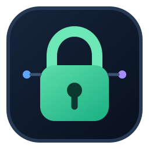
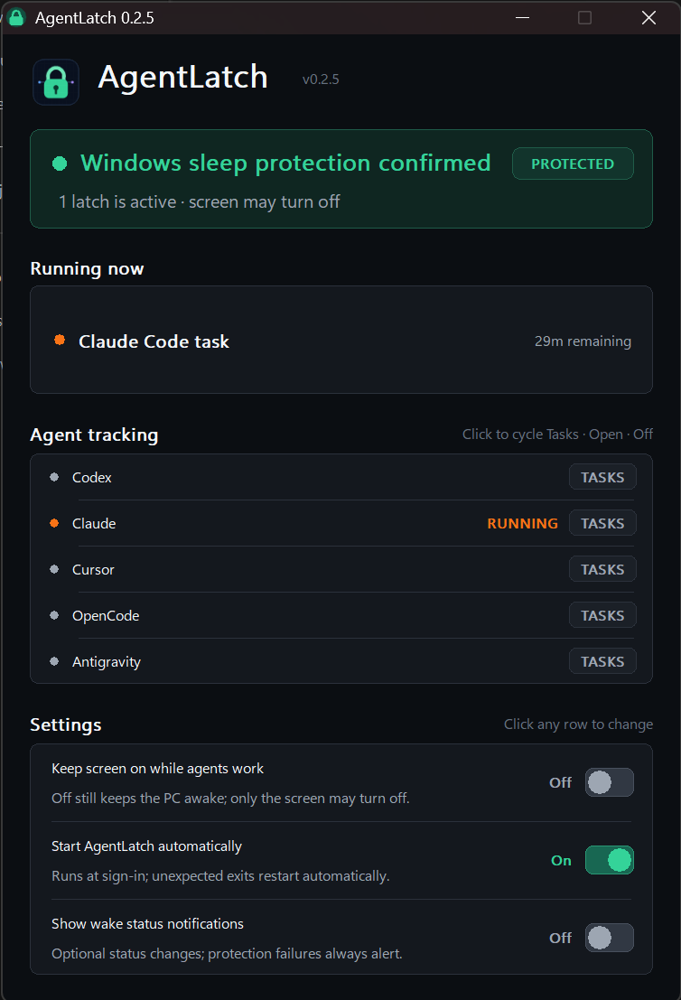

<p align="center">
  
</p>

<h1 align="center">AgentLatch</h1>

<p align="center"><strong>Your agents run. Your PC stays awake.</strong></p>

AgentLatch is a lightweight, open-source Windows tray app that prevents idle sleep only while useful work is still running. It understands concurrent AI coding agents, exposes every active reason, and lets normal Windows sleep behavior return after the final source and any safety grace finish.

<p align="center">
  
</p>

## Why AgentLatch

- **Agent-aware:** watches Codex, Claude Code, Cursor, OpenCode, and Google Antigravity/Gemini CLI.
- **Concurrency-safe:** lifecycle-backed conversations, sessions, and subagents keep independent latches. A regular ChatGPT response counts alongside active Codex tasks; only an overlapping Codex composer response is deduplicated against its lifecycle task.
- **Your choice of precision:** set every provider independently to **Tasks**, **Open**, or **Off**.
- **Task-first by default:** the unified OpenAI app's response state, Codex lifecycle records, and provider hooks track actual work; conservative CLI activity detection is the fallback.
- **Open when you want it:** presence mode deliberately latches while the selected app or CLI is merely running.
- **Transparent:** the dashboard shows exactly what is keeping the machine awake and why.
- **Native and private:** one Win32 executable, no account, no service, no telemetry, and no administrator rights.

AgentLatch uses a Windows power request. It does not jiggle the mouse, synthesize keystrokes, change the system power plan, or prevent a user-initiated shutdown or sleep.

## Provider support

| Provider | Tasks mode | Open mode | Lifecycle hooks |
|---|---|---|---|
| OpenAI / Codex | ChatGPT response state + native Codex lifecycle + hooks/CLI activity | Unified desktop app or CLI | Codex tasks; CLI sessions and subagents |
| Claude Code | Managed hooks; CLI activity for portable installs | Desktop app or CLI | Sessions and subagents |
| Cursor | Hooks + agent CLI activity | Cursor IDE or agent CLI | Agent and subagent events |
| OpenCode | CLI activity | CLI process | External lease API |
| Google Antigravity / Gemini CLI | Antigravity hooks + CLI activity | Antigravity app or Gemini CLI | Antigravity conversations |

In **Tasks** mode, opening an Electron app by itself never latches the computer. For the unified OpenAI Windows app, AgentLatch recognizes both active ChatGPT responses and Codex task lifecycle state, including while the app is minimized. Detector activity is sampled every two seconds and retains a three-minute safety grace by default while the provider remains open; closing the provider or turning it **Off** releases that detector latch immediately. Hook stop events release their matching lifecycle latch immediately, and hook leases expire automatically if an agent crashes or never sends a final event. Click a provider in the dashboard to cycle **Tasks → Open → Off**.

## Install

1. Open the [latest GitHub release](https://github.com/byassin/agent-latch/releases/latest).
2. Download the x64 setup executable for an Intel or AMD Windows PC, or the ARM64 setup executable for a Windows on Arm PC.
3. Double-click the setup executable.
4. Choose whether AgentLatch should start with Windows, then select **Install**.

Setup installs AgentLatch for the current user without an administrator prompt, creates normal Start menu and Windows uninstall entries, replaces an older running copy cleanly, and launches the new version. The exact stable version is always visible beside the AgentLatch name in the dashboard and in the window title.

Codex, Claude Code, Cursor, and Google Antigravity lifecycle integrations are installed automatically. Existing provider configuration is preserved, duplicate entries are avoided, and a timestamped backup is made before a changed JSON file is written. The Windows uninstaller removes only AgentLatch's own integration entries.

OpenAI desktop detection is native and automatic for the packaged unified Windows app. AgentLatch reads Codex's local start/complete lifecycle markers and observes only the primary composer button's Windows accessibility metadata so ChatGPT responses also keep the PC awake. English Send/Stop names are recognized directly; other locales are learned conservatively from a stable disabled idle command. AgentLatch never reads prompt, response, or conversation content. If the expected control cannot be classified after an app update, detection fails closed instead of keeping the PC awake. No chat command, hook trust dialog, or separate setup step is required. Codex CLI hooks remain an additional signal when available.

Windows may display a SmartScreen warning until project releases are Authenticode-signed.

### Verify a download

Each release includes a `.sha256` sidecar beside every setup executable and a combined `SHA256SUMS.txt`. Compare the installer hash with either published value before running it:

```powershell
Get-FileHash .\AgentLatch-Setup-0.2.4-x64.exe -Algorithm SHA256
Get-Content .\AgentLatch-Setup-0.2.4-x64.exe.sha256
```

Replace the version and architecture in those filenames with the asset you downloaded.

## Command-line lease API

Any local tool can acquire a renewable latch:

```powershell
AgentLatch.exe --acquire --id build-42 --source external --label "Release build" --detail "ARM64 package" --ttl 900
AgentLatch.exe --release --id build-42
```

Leases are local to the signed-in Windows session, fields are bounded and sanitized, and TTLs are capped at 24 hours. Repeating `--acquire` with the same ID renews that lease.

Other commands:

```text
--show           Open the dashboard
--quit           Exit the background app
--self-test      Run the built-in core tests
--hook PROVIDER  Accept one lifecycle event as JSON on stdin
```

## Build from source

Requirements:

- Windows 10 or Windows 11
- Visual Studio 2022 Build Tools with Desktop development with C++
- CMake 3.24 or newer
- Inno Setup 7 when building the Windows setup executable

```powershell
git clone https://github.com/byassin/agent-latch.git
cd agent-latch
.\scripts\build.ps1
```

The x64 build script runs the executable's self-test before reporting success. CI also compiles ARM64.

Build the setup executable after compiling AgentLatch:

```powershell
.\scripts\build-installer.ps1 -Executable .\build-x64\Release\AgentLatch.exe -Version 0.2.4
```

## Design principles

- A wake reason is a lease, never an unexplained global switch.
- The display is allowed to turn off by default while the system stays awake.
- Wake-status notifications can be disabled from the dashboard or tray menu.
- Dashboard settings explain the difference between PC wake protection, keeping the screen on, and launching AgentLatch at Windows sign-in.
- Every automatic path has a timeout or observable process state.
- Provider integrations are additive and editable; existing hook configuration belongs to the user.
- Normal Windows sleep behavior returns when the last latch releases; detector activity may intentionally remain latched for its bounded safety grace.

Read [Architecture](docs/ARCHITECTURE.md), [Privacy](docs/PRIVACY.md), and [Contributing](CONTRIBUTING.md) for more.

## License

AgentLatch is available under the [MIT License](LICENSE).
